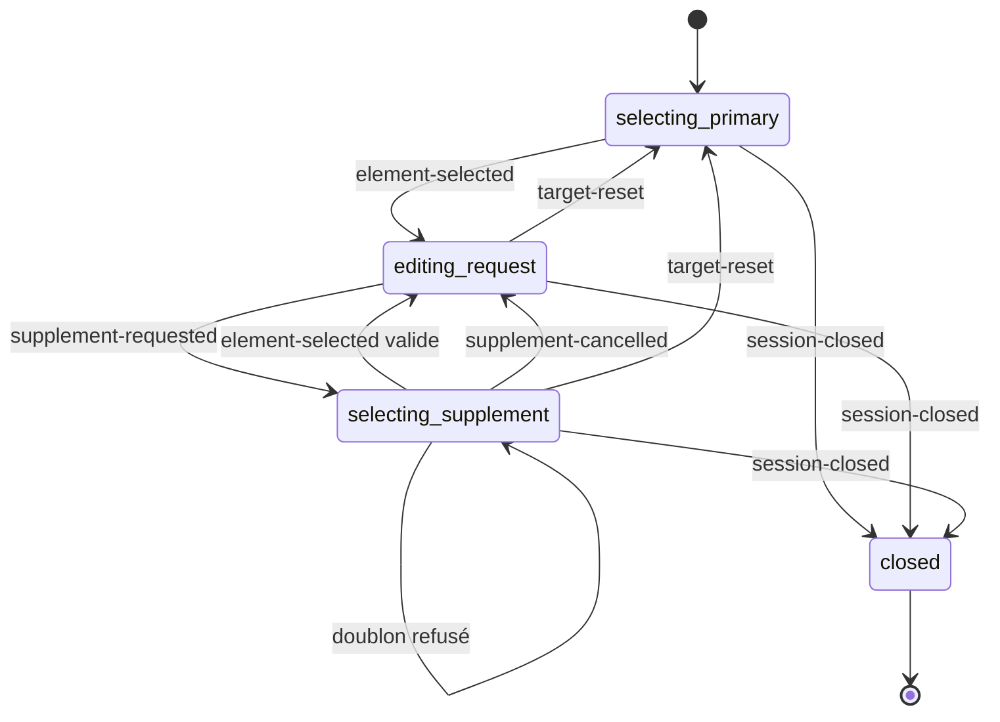

# Lire et faire évoluer Cadranote

L’extension accompagne un seul parcours : choisir un **principal**, écrire une **demande**, puis ajouter des **compléments**. Le code doit permettre de retrouver chaque règle sans parcourir les détails du navigateur.

## Ordre de lecture

1. [`src/domain/session.ts`](src/domain/session.ts) nomme les états et les événements du parcours.
2. [`src/domain/session-machine.ts`](src/domain/session-machine.ts) décrit ce que chaque événement change.
3. [`src/application/session-controller.ts`](src/application/session-controller.ts) relie ces règles à la sélection, au panneau et à la copie.
4. [`src/ui/panel.html`](src/ui/panel.html) montre la structure de l’interface ; [`panel.css`](src/ui/panel.css) définit sa présentation.
5. Ouvrir l’adaptateur concerné pour comprendre un détail de Chrome, du DOM ou du presse-papiers.

## Les règles que le code protège

- La demande contient au maximum un principal.
- Un complément nécessite un principal et ne peut pas le remplacer.
- Le principal ne figure pas dans les compléments ; un complément ne figure qu’une fois dans la liste.
- Ajouter, retirer, vider ou annuler un complément conserve le texte de la demande.
- **Changer de cible** efface le principal et tous les compléments ; le texte et la préférence d’ouverture de la section sont conservés.
- **Élément parent** remplace explicitement le principal. Si le parent figurait dans les compléments, il en est retiré.
- La copie du contenu, du HTML et du sélecteur concerne toujours le principal.
- La copie du contexte comprend le principal, les compléments numérotés et une seule demande.
- Fermer termine la session et libère les écouteurs, les cadres, le panneau et les références DOM.

## Une machine à états explicite

Les noms réels dans TypeScript utilisent des tirets : `selecting-primary`, `editing-request`, `selecting-supplement`, `closed`.

| État | Principal | Compléments | Clic dans la page |
|---|---|---|---|
| `selecting-primary` | Aucun | Liste vide | Définit le principal |
| `editing-request` | Obligatoire | Zéro ou plusieurs | Comportement normal du site |
| `selecting-supplement` | Obligatoire et conservé | Conservés | Ajoute un complément valide |
| `closed` | Aucun | Liste vide | Aucun écouteur de sélection |

Le type est une **union discriminée**. Il interdit à la compilation les combinaisons comme « ajout d’un complément sans principal ». La fonction `transitionSession(state, event)` est pure : elle reçoit des données, retourne de nouvelles données et ne touche ni au DOM ni à Chrome. Elle ne modifie pas son entrée et ignore les événements qui ne s’appliquent pas à l’état courant. L’état fermé est terminal.

Les survols, numéros de frame d’animation et opérations de presse-papiers ne sont pas des états métier. Ils restent dans leurs adaptateurs.

## Responsabilités des modules

| Dossier | Ce qu’il possède | Ce qu’il ne doit pas décider |
|---|---|---|
| `domain/` | Types, invariants et transitions | Affichage, API Chrome, accès DOM |
| `application/` | Coordination et reprise d’une session injectée | Algorithme des sélecteurs, CSS |
| `dom/` | Résolution des éléments, sélecteurs, capture et extraction | Transitions du parcours |
| `inspection/` | Adaptateurs React/Vue/Angular, analyse Tailwind et validation des réponses | Transitions du parcours |
| `selection/` | Interception des événements pendant une sélection | Ajout ou remplacement métier |
| `highlights/` | Cadres bleus/verts, géométrie et animations | Principal et liste métier |
| `ui/` | Présentation et actions utilisateur explicites | Règles d’ajout ou de réinitialisation |
| `export/` | Contenu à copier et format du message IA | Accès au presse-papiers |
| `platform/` | Presse-papiers et solution de repli | Contenu du message |
| `entrypoints/` | Activation Chrome et création de l’application | Détails du parcours |

Le domaine n’importe aucun de ces adaptateurs. Le contrôleur interprète une action de l’interface, prépare les données si nécessaire, demande une transition, puis actualise le panneau et les cadres.

## Données et références DOM

`TargetSnapshot` contient un identifiant, une description capturée, l’URL et le titre de la page. `SessionState` ne contient aucun `Element` : il est sérialisable.

`ElementRegistry` est le seul registre des correspondances entre identifiants et éléments DOM. Les identifiants restent stables tant que le nœud reste le même. Après retrait ou remise à zéro, le registre libère les références fortes devenues inutiles. Les surlignages libèrent également leurs références.

Un snapshot de complément reste utilisable si le nœud disparaît. Le texte exporté signale alors la disparition. Le principal est relu lors d’une copie s’il est toujours présent.

La session n’est pas persistée sur disque. La sérialisation prépare une évolution future ; elle ne permet pas de restaurer automatiquement un élément après un rechargement de page.

## Injection et cycle de vie

Chrome injecte **un seul `content.js` autonome**, compilé depuis `src/entrypoints/content.ts`. Les fonctions métier sont des imports ; il n’existe plus de module global `HTMLLocatorCore` en production.

Dans le contexte isolé, le point global `__htmlLocator`, permet de récupérer puis de fermer l’instance précédente dans le même document. La reprise est versionnée avec `RuntimeSnapshot.version`. Son `session` est constitué de données ; ses `bindings` sont un transfert temporaire de références DOM dans le même contexte, jamais un format de stockage ou de message interprocessus.

Le passage depuis l’ancien `getState()` est isolé dans `runtime-handoff.ts`. Il récupère la demande et les cibles encore présentes. Les cibles déjà disparues de l’ancienne version ne sont pas migrées. Une session fermée ne se restaure pas.

Chaque ressource a un propriétaire et une méthode de nettoyage : le contrôleur ferme la sélection, arrête les opérations de repli du presse-papiers, détruit les cadres et le panneau, puis libère le registre. L’appel natif de copie déjà lancé ne peut pas être annulé, mais une copie terminée après une fermeture ou un changement de cible ne met pas à jour une interface obsolète.

## Conventions de lisibilité

- Noms métier explicites : `primary`, `supplements`, `instruction`, `selectPrimaryParent`, `prepareContextCopy`.
- Une fonction effectue une action identifiable ; les détails viennent après l’intention principale.
- Types `readonly` pour les données partagées et résultats explicites pour les erreurs attendues.
- Retours anticipés pour les préconditions ; pas de combinaisons de booléens pour représenter le parcours.
- Commentaires et summaries courts : décrire uniquement une propriété ou un cas particulier que les noms et le code ne rendent pas évident. Supprimer les explications redondantes et les récits de conception.
- Le code et les identifiants sont en anglais ; l’interface et la documentation sont en français.
- HTML et CSS séparés de la logique. Toute donnée de page affichée passe par `textContent`.
- TypeScript strict, contrôle des index, propriétés optionnelles exactes et détection des variables inutilisées.
- Prettier fixe l’indentation, les retours à la ligne et l’espacement pour toute l’équipe.

Pour ajouter une règle de parcours : commencer par un événement et son test dans `tests/session-machine.test.ts`, implémenter la transition, puis relier l’action du panneau. Pour un nouveau format de copie : travailler dans `export/`, sans modifier la sélection.

## Construction et vérification

`npm run build` utilise esbuild pour produire `content.js`, `background.js` et `page-inspector.js` à la racine, afin de conserver le dossier actuellement chargé dans Chrome. Ces fichiers sont des sorties de compilation, pas les sources à éditer.

`npm run check` exécute TypeScript et vérifie le formatage. `npm test` compile puis exécute :

- Les tests de transitions sous Node, sans navigateur.
- Les scénarios utilisateur et les tests de sélecteurs dans Chrome headless.

Le fichier `tests/locator-harness.ts` expose quelques fonctions uniquement dans le navigateur de test. Il est compilé dans `.test-build/` et n’est jamais injecté ni distribué en production.

`npm run package` vérifie le projet et crée une archive limitée au manifeste, aux bundles JavaScript, à l’aide et aux icônes. Les dépendances de développement, tests et sources restent dans le dépôt.

Cette refactorisation conserve les limites fonctionnelles documentées dans le README, notamment les iframes, les racines Shadow DOM fermées et l’absence de correspondance automatique vers un fichier source. Les tests navigateur injectent le bundle dans une page de test ; ils ne simulent pas encore une installation depuis le Chrome Web Store.

## Inspection des composants

Le contrôleur demande une inspection après chaque sélection. Le service worker injecte `page-inspector.js` dans le monde `MAIN`, puis appelle sa fonction `__cadranoteInspect` avec la chaîne de sélecteurs. Cette fonction ne conserve aucune cible et ne donne accès à aucune API privilégiée. Le document est identifié dans la requête pour éviter une inspection sur une nouvelle page après navigation. Aucun accès supplémentaire n’est ajouté au manifeste.

Les adaptateurs lisent uniquement les noms, parents et chemins de fichiers exposés. Les parcours, chaînes et tableaux sont bornés. Les résultats venant du monde de la page sont des données non fiables : le client valide leur forme, limite leur taille et le panneau les affiche avec `textContent`. Les métadonnées ne sont jamais interprétées comme des commandes.

L’événement `target-inspected` enrichit uniquement l’instantané d’origine encore présent. Une réponse tardive ne rétablit pas une cible retirée ou remplacée. La copie attend les inspections des cibles courantes, avec une échéance de 1,8 seconde. Une indisponibilité laisse la sélection et la copie HTML utilisables.

Les tests couvrent des métadonnées représentatives, la séparation des mondes JavaScript via CDP, les cycles, les propriétés inaccessibles et la copie des compléments disparus. Ils ne constituent pas une matrice de certification de toutes les versions de frameworks.
