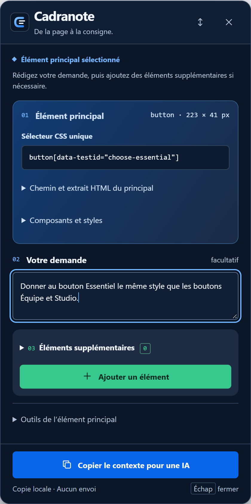
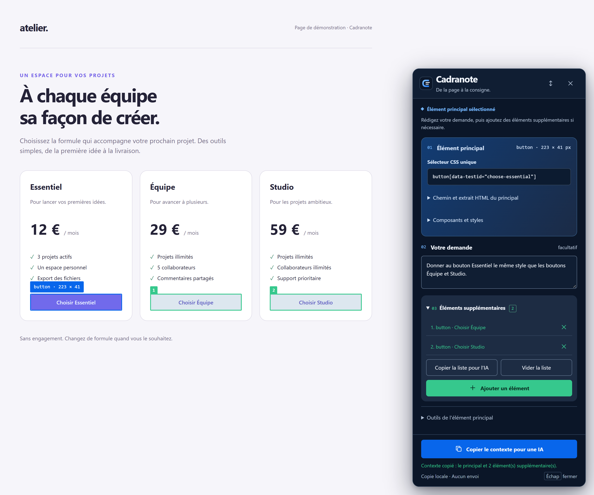

# Cadranote

**De la page à la consigne.**


Extension Chrome qui permet de sélectionner un élément visuellement, comme avec le sélecteur de DevTools, puis de copier le contexte nécessaire pour le cibler dans une conversation avec une IA.

## Aperçu

Le panneau rassemble la cible, la demande et les actions de copie.



### Exemple : harmoniser les boutons d’une page de tarifs

Le bouton **Essentiel** est la cible principale, en bleu. Les boutons **Équipe** et **Studio**, en vert, servent de références. La demande : « Donner au bouton Essentiel le même style que les boutons Équipe et Studio. »



**Copier le contexte pour une IA** rassemble la demande et les trois éléments dans un seul message à coller dans votre assistant de code.

Ces captures montrent le panneau réel sur la [page de démonstration](docs/demo.html), avec la section des compléments dépliée dans le second exemple.

## Installer dans Chrome

Depuis un clone du dépôt, installez Node.js 22 puis exécutez à la racine :

```powershell
npm ci
npm run build
```

Depuis un ZIP de distribution, décompressez simplement l’archive.

1. Ouvrez `chrome://extensions`.
2. Activez **Mode développeur** en haut à droite.
3. Cliquez sur **Charger l’extension non empaquetée**.
4. Sélectionnez le dossier contenant ce fichier et `manifest.json`.
5. Dans le menu Extensions (icône puzzle), épinglez **Cadranote**.

Le ZIP de distribution contient uniquement les fichiers nécessaires à Chrome. Les fichiers compilés sont générés à la racine et ne sont pas versionnés.

## Utiliser

1. Ouvrez votre site, y compris une application sur `localhost`.
2. Cliquez sur l’icône de Cadranote, ou appuyez sur **Alt+Maj+C**.
3. Survolez la page : le cadre bleu indique l’élément visé et ses dimensions.
4. Cliquez sur votre **élément principal** : le clic est intercepté pour éviter son action habituelle.
5. Rédigez votre demande dans le champ prévu.
6. Si nécessaire, cliquez sur **+ Ajouter un élément**, puis sur un autre élément dans la page. Il rejoint automatiquement la liste des **éléments supplémentaires**. Répétez pour chaque complément, puis cliquez sur **Copier le contexte pour une IA**.
7. Collez le texte dans ChatGPT, Codex, Claude ou votre outil de code.

**Copier le sélecteur**, **Copier le contenu** et **Copier l’extrait HTML** portent toujours sur l’élément principal. **Élément parent** remplace le principal par son conteneur, en conservant la demande et les compléments (si ce conteneur était dans la liste, il en est retiré pour éviter un doublon).

Ces actions et **Changer de cible** sont regroupés dans **Outils de l’élément principal**. Le bouton **Copier le contexte pour une IA** reste visible en bas du panneau pendant le défilement.

**Changer de cible** efface le principal et tous les éléments supplémentaires, puis relance la sélection du principal. Le texte de votre demande est conservé. **Vider la liste** retire uniquement les éléments supplémentaires.

Pendant l’ajout d’un complément, **Échap** ou **Annuler l’ajout** revient à la demande. En dehors de ce mode, **Échap** ferme le panneau. Cliquer de nouveau sur l’extension restaure la demande en cours. Le raccourci peut être modifié sur `chrome://extensions/shortcuts` s’il est déjà utilisé.

**Copier le contenu** copie le texte du principal et de ses descendants, sans la limite de 240 caractères du contexte IA. Les espaces sont normalisés et les champs de formulaire, scripts et styles sont exclus. Collez ensuite avec **Ctrl+V**. **Copier l’extrait HTML** copie ses balises, avec les mêmes limites de taille que l’aperçu.

Le contexte contient l’URL sans paramètres ni fragment, le titre de la page, un sélecteur unique dans la racine DOM actuelle, le chemin HTML, l’accès JavaScript, le texte, les dimensions et un extrait HTML limité. La priorité des sélecteurs est donnée aux attributs de test, puis à l’identifiant, aux attributs et aux classes ; un chemin avec `nth-of-type` sert de recours.

## Inspecteurs de composants

La section **Composants et styles** affiche les indices disponibles pour l’élément principal. Ils sont automatiquement inclus dans **Copier le contexte pour une IA**, pour le principal et chaque complément.

- **React** : noms et hiérarchie via les métadonnées Fiber, fichier si exposé par le build.
- **Vue 2 et Vue 3** : noms, parents et fichier du composant si disponible. Les instances anonymes montées dans une page HTML sont signalées sans inventer de nom. Les conteneurs de montage et les marqueurs de styles permettent aussi de relever des indices Vue lorsque les instances ne sont pas exposées.
- **Angular** : composant et propriétaires via les API de débogage `ng.getComponent` et `ng.getOwningComponent`. Sans ces API, les marqueurs DOM (`ng-version`, `_nghost-*`, `_ngcontent-*`) permettent de signaler des indices Angular sans inventer de nom de composant. Le panneau distingue les indices liés à la cible de la présence d’Angular ailleurs sur la page.
- **Tailwind** : classes utilitaires compatibles, avec leurs variantes. C’est un indice, pas une identification certaine de Tailwind.

Les noms vont du composant le plus proche vers ses parents. Ils peuvent être absents ou minifiés en production ; aucun chemin de fichier n’est inventé. Les adaptateurs React et Vue utilisent des propriétés internes qui peuvent changer selon la version. Les props, l’état des composants et les services Angular ne sont pas extraits.

L’inspection est locale et prise lors de la sélection. La copie attend sa réponse pendant au plus 1,8 seconde ; si elle échoue, le contexte HTML reste disponible. Retirez puis ajoutez un élément pour renouveler ses indices techniques.

## Démonstration

### Attacher plusieurs éléments

1. Sélectionnez le principal et rédigez la demande, par exemple « Donner au principal le style du complément 1 ».
2. Cliquez sur **+ Ajouter un élément** (bouton vert), puis sur l’élément supplémentaire dans la page. Le principal reste inchangé. Recommencez pour ajouter d’autres compléments.
3. La liste affiche les compléments dans leur ordre d’ajout. Cliquez sur un nom pour le repérer dans la page, sur **×** pour le retirer, ou sur **Vider la liste** pour retirer tous les compléments. Le principal et les doublons ne peuvent pas être ajoutés à cette liste.
4. Cliquez sur **Copier le contexte pour une IA** : le message distingue le principal des compléments numérotés et contient votre demande une seule fois.

Chaque complément est encadré en **vert**, comme le bouton d’ajout, avec le numéro correspondant à sa place dans la liste. Les cadres suivent le défilement et les déplacements des éléments ; ils disparaissent au retrait, à la remise à zéro ou à la fermeture du panneau. L’élément principal reste repéré en bleu.

La liste **Éléments supplémentaires** est repliée par défaut. Cliquez sur son titre pour la déplier ou la replier. Le compteur et le bouton **Ajouter un élément** restent visibles ; les surlignages et la copie du contexte restent actifs. L’état ouvert ou fermé est conservé lorsque vous réactivez l’extension dans le même onglet.

Les compléments sont des instantanés du DOM au moment de leur ajout, avec les mêmes limites d’extrait HTML que la copie individuelle. Ils restent disponibles si l’élément disparaît de la page ; le message copié le signale. Retirez puis ajoutez de nouveau un complément pour actualiser son instantané. Le contexte du principal est actualisé à la copie s’il existe encore, sinon son instantané initial est utilisé avec une indication de disparition.

**Copier la liste pour l’IA** copie uniquement les compléments et la demande. **Copier le contexte pour une IA** copie toujours le principal, la demande et tous les compléments ; il reste disponible pendant la sélection d’un complément.

Le champ **Votre demande** reste affiché pendant la sélection. Ajouter un élément ou changer de cible ne le vide pas.

Le principal, la liste et la consigne sont conservés quand vous réactivez l’extension par l’icône ou le raccourci. Fermer le panneau ou recharger la page les efface. La demande reste locale à l’onglet, sans stockage persistant.

### Page de démonstration

Ouvrez `tests/fixture.html` dans Chrome. Pour utiliser l’extension sur cette page locale, activez **Autoriser l’accès aux URL de fichier** dans les détails de l’extension. La page permet de tester les boutons similaires, les conteneurs et un composant Shadow DOM.

## Portée et limites

- Le chemin correspond au **DOM rendu**. Les inspecteurs peuvent ajouter un nom de composant ou un fichier exposé par la page, sans garantir le fichier d’origine ni son numéro de ligne. L’IA doit vérifier ces indices dans le projet.
- Un sélecteur est vérifié à l’instant de la sélection. Une page dynamique peut ensuite modifier la structure, les classes ou les identifiants.
- Les racines Shadow DOM **ouvertes** sont prises en charge. `>>>` sépare leurs sélecteurs et n’est pas du CSS standard ; le contexte fournit aussi l’expression JavaScript de traversée. Une racine fermée n’expose que son hôte.
- Une iframe est sélectionnée comme un élément. Pour inspecter son contenu, ouvrez sa page directement dans un onglet. La sélection ne traverse pas les iframes.
- Les pages internes de Chrome, le Chrome Web Store et certaines pages protégées ne permettent pas l’injection d’extensions.
- Le bouton **↕** déplace le panneau en haut ou en bas pour libérer une zone qu’il recouvre.
- Le surlignage suit les défilements et redimensionnements. Les animations autonomes peuvent déplacer un élément après sélection.
- Des gestionnaires de capture déjà installés par une page peuvent recevoir les événements avant l’extension.

## Données et permissions

Tout fonctionne localement, sans serveur, sans appel à une IA et sans historique conservé. Le contexte est copié uniquement à votre demande. Les champs de formulaire ne sont pas lus à partir de leur valeur courante ; les attributs `value` et le contenu des `textarea` sont retirés de l’extrait. Le texte et les autres attributs présents dans la page peuvent contenir des informations privées : vérifiez l’extrait avant de le partager.

- `activeTab` : accès temporaire à l’onglet après activation explicite.
- `scripting` : injection du sélecteur sur cet onglet.
- `clipboardWrite` : copie à votre demande.

Architecture Manifest V3 conforme au fonctionnement documenté de [`activeTab`](https://developer.chrome.com/docs/extensions/develop/concepts/activeTab) et de [`chrome.scripting`](https://developer.chrome.com/docs/extensions/reference/api/scripting).

## Développement et vérification

Le code source est en **TypeScript strict**, dans `src/`. `content.js`, `background.js` et `page-inspector.js` sont générés : ne pas les modifier directement. Le HTML et le CSS du panneau sont dans `src/ui/`.

Commencez par [ARCHITECTURE.md](ARCHITECTURE.md) : il présente les règles du parcours, la machine à états, les responsabilités et l’ordre de lecture conseillé.

Avec Node.js 22 et Chrome installés :

```powershell
npm ci
npm run format
npm run check
npm test
npm run package
```

`check` vérifie les types et le formatage. `test` compile les scripts puis exécute les tests purs de la machine à états et les tests navigateur. `build` permet de reconstruire uniquement les fichiers Chrome. `package` lance les vérifications puis recrée `Cadranote.zip` (commande de packaging Windows/PowerShell).

Les tests navigateur utilisent Chrome en mode headless sur une page locale. Ils vérifient les sélecteurs, les identifiants dupliqués, le Shadow DOM, l’interception des clics, le presse-papiers, la réinjection et la fermeture. Ils injectent le script compilé dans une page de test ; le chargement de l’extension et son bouton dans la barre Chrome restent à vérifier manuellement après installation. Les helpers d’analyse exposés aux tests sont compilés séparément et ne sont pas livrés dans l’extension.

Après modification de `src/`, exécutez `npm run build`, cliquez sur **Actualiser** dans `chrome://extensions` et rechargez l’onglet du site.

### Icône et captures

La [direction visuelle](docs/IDENTITY.md) définit le nom, la palette et les principes du panneau.

L’icône source est dans `src/ui/logo.svg`. Elle est intégrée au panneau ; `npm run icons` génère ses variantes PNG de 16, 32, 48 et 128 pixels pour Chrome.

`npm run docs:capture` compile l’extension, ouvre `docs/demo.html` dans Chrome et reproduit le parcours pour actualiser les deux captures dans `docs/images/`. Le script vérifie aussi que le contexte copié contient les trois cibles. Ces captures sont versionnées pour rester visibles sur GitHub.

## Contribuer

Versionnez les sources et `package-lock.json`. Les dépendances, les bundles, les captures de test et les archives sont exclus par `.gitignore`.

Avant un commit, lancez `npm run package` sous Windows : cette commande vérifie le formatage, les types, les tests et la création de l’archive.

Sur GitHub, le workflow **Vérification** exécute ces contrôles à chaque push et pull request. Si les contrôles réussissent, le ZIP est disponible dans les artefacts du workflow. Il n’est pas publié sur le Chrome Web Store.
